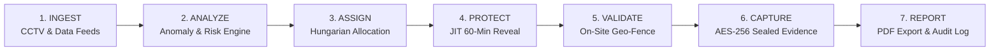
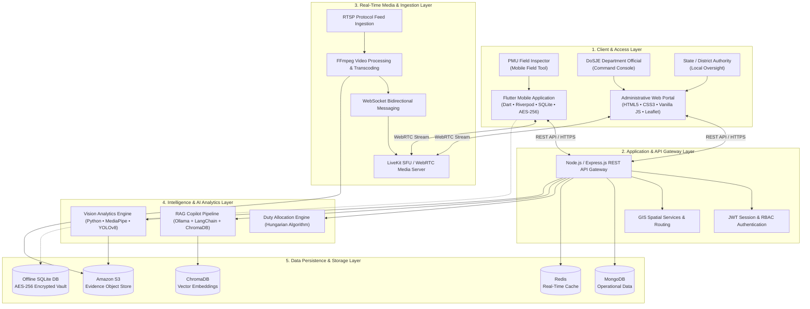
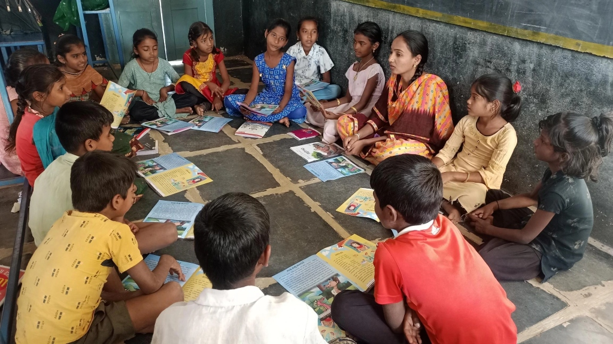
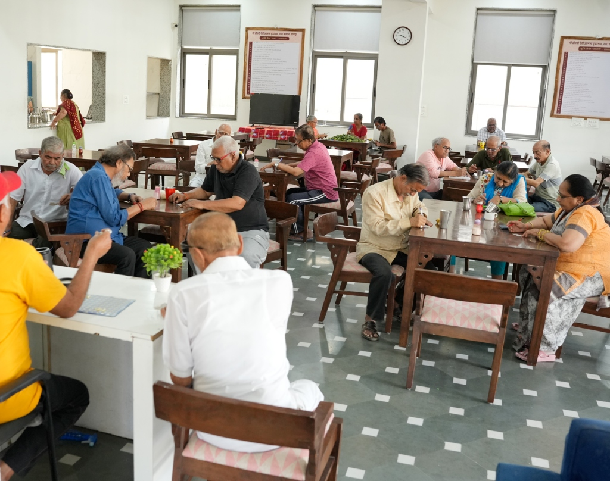

<a id="top"></a>

<div align="center">


<b><a href="#live-links">Live Links</a> &nbsp;|&nbsp; <a href="#sec-3">Overview</a> &nbsp;|&nbsp; <a href="#sec-7">Features</a> &nbsp;|&nbsp; <a href="#sec-8">Innovation</a> &nbsp;|&nbsp; <a href="#sec-9">Architecture</a> &nbsp;|&nbsp; <a href="#sec-12">Status</a> &nbsp;|&nbsp; <a href="#sec-14">Demo</a> &nbsp;|&nbsp; <a href="#sec-15">Setup</a> &nbsp;|&nbsp; <a href="#sec-21">Team</a></b>

<table align="center">
<tr>
<td align="center"><h3>10</h3>Core Deliverables</td>
<td align="center"><h3>10</h3>Innovations</td>
<td align="center"><h3>10</h3>Workflow Stages</td>
<td align="center"><h3>5</h3>Stakeholder Tiers</td>
<td align="center"><h3>2</h3>App Clients<br/><sub>Web Portal & Mobile App</sub></td>
</tr>
</table>

</div>

# 👁️ Drishti360: Smart Real-Time Monitoring & Surprise Inspection Platform

> **A unified monitoring and field inspection ecosystem designed to transition government welfare oversight from periodic, report-dependent visits into continuous risk-informed monitoring, surprise field verification, geo-tagged evidence capture, and AI-assisted decision support.**

---

<a id="live-links"></a>

## 🔗 Live Demo & Video

<div align="center">

[](https://youtu.be/AnqudR6177E?si=sCrJ3rr5GRYmlcq7)
[](https://drishti360.onrender.com/)
[](https://drive.google.com/file/d/1QRNk6M1IF1ViZFZCOvNc_yqt1804pk-p/view?usp=share_link)

</div>

---

### 📋 Quick Evaluation Summary (SIH Evaluator Snapshot)

| Parameter | Details |
| :--- | :--- |
| 📛 **Project Name** | **Drishti360** (Smart Real-Time Monitoring & Surprise Inspection Platform) |
| 🏆 **Hackathon** | **Smart India Hackathon 2026** |
| 🔢 **Problem Statement ID** | **26095** |
| 📝 **Problem Statement Title** | Smart Real-Time Monitoring & Inspection Mobile App |
| 🏛️ **Nodal Authority** | Ministry of Social Justice and Empowerment (MoSJE) — Department of Social Justice and Empowerment (DoSJE) |
| 🗂️ **Theme / Category** | Smart Automation / Software |
| 👥 **Team Identity** | **TEAM CODIFY** (Team ID: `158210`) |
| ⭐ **Primary Differentiator** | Just-In-Time (JIT) surprise inspection routing (~60 min coordinate reveal), AI-driven multi-factor duty allocation, native Android AES-256 GCM encrypted evidence vault, and multi-source verification |
| 💻 **Prototype Availability** | Runnable **Web Application** (Administrative Command Center) & **Mobile Application** (Flutter PMU Field Client with native Android camera activity) |
| 🛠️ **Current Repository Status** | Fully operational Express.js + Leaflet web command desk with JWT auth & memory fallback, 18-screen Flutter mobile application with Riverpod, native Android camera with GPS/IST watermark burn-in, and AES-256 GCM encrypted image vault |

<details open>
<summary><b>📑 Table of Contents</b></summary>

<br/>

| Group | Jump to |
| :-- | :-- |
| **🧭 Overview** | [🔗 Live Demo & Links](#live-links) · [1. Project Title](#sec-1) · [2. SIH Problem Statement](#sec-2) · [3. Executive Overview](#sec-3) · [4. Problem We Address](#sec-4) · [5. Proposed Solution](#sec-5) |
| **⚙️ Solution & Design** | [6. How the System Works](#sec-6) · [7. Key Features](#sec-7) · [8. Innovation & Differentiators](#sec-8) · [9. System Architecture](#sec-9) · [10. Technology Stack](#sec-10) |
| **🚀 Prototype & Run** | [11. Repository Structure](#sec-11) · [12. Implementation Status](#sec-12) · [13. Screenshots / UI Preview](#sec-13) · [14. Demo](#sec-14) · [15. Installation & Setup](#sec-15) · [16. Configuration](#sec-16) · [17. Testing & Validation](#sec-17) |
| **🛡️ Trust & Roadmap** | [18. Security & Privacy](#sec-18) · [19. Limitations](#sec-19) · [20. Future Scope](#sec-20) |
| **👥 Team & References** | [21. Team Information](#sec-21) · [22. References](#sec-22) · [23. Prototype Disclaimer](#sec-23) |

</details>

---

## <a id="sec-1"></a>🎯 1. Project Title & One-Line Value Proposition

**Drishti360: Smart Real-Time Monitoring & Surprise Inspection Platform**  
*Transitioning public welfare scheme monitoring from conventional, periodic, report-dependent inspections into an active, data-informed verification ecosystem.*

Drishti360 is engineered specifically for social justice and empowerment authorities to monitor grant-in-aid institutions, welfare facilities, and non-governmental organizations. The platform digitizes the entire oversight lifecycle—from continuous CCTV surveillance ingestion and automated anomaly detection to unpredictable Just-In-Time surprise inspection dispatch, native geo-fenced evidence collection, encrypted local offline storage, and multi-source decision support.

<p align="right"><sub><a href="#top">⬆ Back to top</a></sub></p>

---

## <a id="sec-2"></a>🏛️ 2. SIH Problem Statement Information

* **Problem Statement ID:** `26095`
* **Problem Statement Title:** Smart Real-Time Monitoring & Inspection Mobile App
* **Organisation:** Ministry of Social Justice and Empowerment (MoSJE)
* **Department:** Department of Social Justice and Empowerment (DoSJE)
* **Category:** Software
* **Theme:** Smart Automation
* **Statutory & Regulatory Baseline:** DoSJE Inspection & Monitoring Procedures, I-MESA Guidelines, National Resource Center for Social Audit (NRCSA) Frameworks, and Guidelines for Assisting NGOs/Organizations.

### 🔍 Problem Context
The Department of Social Justice and Empowerment (DoSJE) supports hundreds of specialized projects, residential hostels, rehabilitation facilities, and vocational training centers through recognized institutes and non-governmental organizations across India. Effective governance requires verifying that financial assistance, physical infrastructure, and welfare services actively reach genuine beneficiaries. Currently, monitoring relies primarily on periodic self-declarations, predictable inspection visits, and fragmented paper reports. This operational model creates significant reporting latency, enables staged compliance during scheduled visits, exposes field evidence to tampering, and leaves central authorities without real-time operational visibility across geographically dispersed facilities.

<p align="right"><sub><a href="#top">⬆ Back to top</a></sub></p>

---

## <a id="sec-3"></a>🔭 3. Executive Overview

Drishti360 establishes an integrated dual-client software environment connecting field reality directly with central administrative oversight. Designed around five distinct stakeholder tiers—**DoSJE Administrative Divisions**, **PMU / Field Inspection Teams**, **State & District Authorities**, **Monitored Institutes / NGOs**, and **Target Beneficiaries**—the platform replaces ad-hoc reporting with continuous, verifiable digital workflows.

```
+----------------------------------------------------------------------------------------------------+
|                                    DRISHTI360 WORKFLOW RUNTIME                                     |
|                                                                                                    |
|  [Continuous Oversight]        [Intelligent Dispatch]          [Field Ground Verification] [Review]|
|  * RTSP CCTV Ingestion  --->   * Risk Score & Anomaly   --->   * JIT Route Reveal (~60m)    --->  *|
|  * Roster / Report Sync        * Hungarian Allocation          * Geo-Fence Validation             *|
|  * Random VC Sessions          * Repeat-Visit Shield           * AES-256 Vault Sealing    [Action] |
+----------------------------------------------------------------------------------------------------+
```

1. **Continuous Centralized Ingestion:** Aggregates institutional profiles, financial sanctions, operational attendance logs, and live RTSP surveillance feeds into a unified command dashboard.
2. **Predictive Risk & Anomaly Scoring:** Synthesizes historical inspection findings, equipment count discrepancies, and attendance variances to calculate dynamic institutional risk scores.
3. **Protected Surprise Dispatch:** Allocates inspections using intelligent matching algorithms while concealing target details behind a cryptographic lock until approximately 60 minutes prior to inspection.
4. **Resilient Field Verification:** Equips PMU officers with an offline-capable mobile app featuring automated perimeter geofencing, native GPS/IST watermark stamping, and hardware-backed AES-256 evidence encryption.

<p align="right"><sub><a href="#top">⬆ Back to top</a></sub></p>

---

## <a id="sec-4"></a>🚧 4. Problem We Address

| Operational Challenge | Conventional Oversight Reality | Drishti360 Solution |
| :--- | :--- | :--- |
| ✍️ **Self-Reported Paperwork** | Authorities rely on quarterly self-submitted reports, introducing severe data lag and proxy reporting risks. | **Centralized Real-Time Command Desk:** Real-time visibility into operational status, pending audits, and live surveillance directories. |
| 🗓️ **Predictable Visit Schedules** | Advance notice enables non-compliant institutions to stage temporary compliance and proxy beneficiaries. | **Just-In-Time (JIT) Routing:** Hidden target identities and GPS coordinates revealed only ~60 minutes prior to arrival. |
| 🗄️ **Fragmented Data Silos** | Surveillance, physical inspection logs, financial disbursements, and attendance rosters reside in isolated systems. | **Multi-Source Intelligence Fusion:** Unified cross-referencing between CCTV streams, field reports, and attendance records. |
| ⏱️ **Delayed Issue Discovery** | Irregularities, ghost beneficiaries, and equipment deficits are typically identified months after grant disbursement. | **AI Anomaly & Attendance Analytics:** Automated detection of attendance drops and equipment variances triggering rapid alerts. |
| 📸 **Vulnerable Field Evidence** | Plain photographs stored in consumer smartphone galleries risk timestamp alteration, metadata stripping, or substitution. | **AES-256 Hardware Evidence Vault:** Indelible GPS/IST burn-in watermarks and Android Keystore AES-256 GCM file encryption. |
| 📶 **Field Connectivity Deficits** | Remote rural inspection sites lack reliable cellular coverage, causing cloud-dependent forms to crash or drop state. | **Offline-First Field Architecture:** Embedded SQLite storage with automatic queued synchronization when connectivity resumes. |

<p align="right"><sub><a href="#top">⬆ Back to top</a></sub></p>

---

## <a id="sec-5"></a>💡 5. Proposed Solution

Drishti360 delivers six core functional modules aligned with the deliverables of Problem Statement 26095:

```
+-------------------------------------------------------------------------------------------------------+
|                                    CORE SOLUTION CAPABILITIES (DoSJE)                                 |
+-----------------------------------+-----------------------------------+-------------------------------+
| 01. Centralized Command Desk      | 02. Live CCTV Stream Integration  | 03. Random Video Verification |
| National GIS map, KPI metrics,    | RTSP feed directory, multi-camera | Unscheduled WebRTC/LiveKit    |
| active alerts, and audit logs     | grid with recording indicators    | calls with project in-charges |
+-----------------------------------+-----------------------------------+-------------------------------+
| 04. Mobile Inspection Engine      | 05. Algorithmic Duty Assignment   | 06. Geo-Tagged Evidence Vault |
| 18-screen offline Flutter client, | Multi-factor workload balancing,  | Live camera capture, GPS/IST  |
| checklists, and PDF generators    | repeat-visit prevention engine    | burn-in, AES-256 GCM storage  |
+-----------------------------------+-----------------------------------+-------------------------------+
```

1. **Centralized Real-Time Monitoring Dashboard:** A unified web console providing DoSJE officials with macro-level insights across registered organizations, allocated budgets, active projects, and live anomaly queues.
2. **Live CCTV Feed Integration:** Direct ingestion and display of institutional camera feeds, allowing officials to visually verify facility operations on demand.
3. **Random Video Conferencing (VC):** Unscheduled, ad-hoc video interaction connecting department officials directly with project in-charges, staff, or beneficiaries to eliminate staged presentations.
4. **Mobile-Based Field Inspection Module:** A purpose-built Flutter field application enabling PMU inspectors to complete structured evaluations, capture observations, and compile audit records directly on-site.
5. **Random & Automated Duty Assignment:** Algorithmic dispatch designed to match inspection capacity against priority facilities while mitigating manual bias and preventing repetitive inspector-institution pairings.
6. **Geo-Tagged Evidence & AES-256 Vault:** Native coordinates and timestamps embedded into inspection records to establish an unalterable spatial record of every field activity, stored in an encrypted local sandbox.

<p align="right"><sub><a href="#top">⬆ Back to top</a></sub></p>

---

## <a id="sec-6"></a>⚙️ 6. How the System Works

The platform follows a rigorous ten-stage digital workflow connecting continuous oversight with field action:



### 🛡️ Architectural Guardrail: Deterministic Verification vs. AI Decision Support
> [!IMPORTANT]
> **Drishti360 maintains strict separation between official verification decisions and assistive intelligence:**
> * **Official Verification & Compliance (Authoritative):** All regulatory inspection verdicts, formal compliance sanctions, fund releases, and audit findings are determined and signed off strictly by authorized human DoSJE officials.
> * **Intelligent Assistance (Non-Authoritative):** AI/ML features (CCTV headcount estimation, anomaly flagging, duty assignment recommendations, OCR document comparison, and RAG checklist copilots) operate strictly as human-in-the-loop decision-support tools. AI models cannot autonomously penalize an institution or approve grants without human review.

### 🔄 End-to-End Workflow Stages:
1. **Registration & Data Ingestion:** Institutions, projects, allocated budgets, and RTSP camera endpoints are registered within the central database.
2. **Continuous Oversight:** Administrative dashboards maintain live visibility across registered facilities, ingesting status reports and CCTV media.
3. **Automated Anomaly Detection:** Analytical modules monitor operational streams for anomalies, such as attendance count mismatches or missing equipment.
4. **Risk-Based Duty Prioritization:** Facilities displaying recurrent anomalies or long inspection gaps receive elevated inspection priority scores.
5. **Automated Assignment Dispatch:** The assignment engine allocates duties based on proximity, current inspector workload, and historical assignments to prevent bias.
6. **Just-In-Time Route Release:** The target facility's identity and GPS coordinates remain obscured, releasing approximately 60 minutes prior to the inspection window.
7. **Geo-Fenced Ground Validation:** Upon arrival, the mobile application validates that the inspector's device resides within the designated institutional boundary.
8. **Encrypted Evidence Capture:** Field photographs are captured directly with indelible GPS coordinates, timestamps, and address metadata, then encrypted into an AES-256 vault.
9. **Central Verification & Cross-Examination:** Central officials review the completed field checklist, cross-reference evidence against CCTV archives, or launch an ad-hoc video verification call.
10. **Governance Action & Audit Logging:** Inspection outcomes are recorded into an immutable audit log, triggering automated PDF report generation and administrative follow-up.

<p align="right"><sub><a href="#top">⬆ Back to top</a></sub></p>

---

## <a id="sec-7"></a>✨ 7. Key Features

### 🌐 Centralized Oversight & Surveillance (Web Platform)
* **National GIS Command Desk:** Interactive Leaflet map displaying registered NGO locations across India with color-coded risk heat markers.
* **CCTV Surveillance Directory:** Multi-channel live video feed directory with camera health indicators and full-screen inspection modes.
* **Surprise Video Verification:** WebRTC video conferencing module to initiate unscheduled audio-visual checks with institutional personnel.
* **Real-Time Anomaly Triage:** Consolidated feed categorizing operational alerts by severity (Critical, High, Medium) with direct action triggers.

### 📱 Field Inspection & Offline Operation (Mobile Application)
* **Comprehensive 18-Screen Mobile Suite:** Purpose-built Flutter application covering assignments, active checklists, report downloads, and profiles.
* **Offline-First Field Persistence:** Local SQLite data store enabling complete inspection execution without cellular connectivity.
* **Instant A4 PDF Report Generation:** Client-side document compiler generating structured inspection summaries directly on the device.
* **Dynamic Multi-Point Checklists:** Step-by-step evaluation matrices covering building safety, hygiene, drinking water, fire compliance, and sanitation.

### 🛡️ Evidence Integrity, Geo-Tagging & Vault
* **Hardware-Backed AES-256 GCM Vault:** Native Android Keystore `MasterKey` implementation encrypting captured photos in private storage.
* **Live GPS Watermark Burn-In:** Camera activity indelibly stamping latitude, longitude, altitude, IST timestamps, and map thumbnails onto images.
* **In-Memory Decryption Viewer:** Secure gallery decrypting evidence directly into memory buffers, preventing unencrypted file leakage.
* **Automated Geofence Verification:** Distance checks validating that the inspector is physically situated within the registered project perimeter.

### 🤖 Intelligent Decision Support & Analytics (Assistive)
* **Just-In-Time (JIT) Route Concealment:** Cryptographically locked dispatch releasing coordinates ~60 minutes prior to visit.
* **AI Inspection Copilot (RAG):** Mobile assistant interface querying statutory guidelines to answer inspector regulatory questions.
* **Repeat-Visit Prevention Engine:** Duty allocation considering past inspector history to ensure unbiased inspection rotations.
* **Multi-Source Evidence Comparison:** Cross-referencing field observations, OCR extracted documents, and CCTV analytics.

<p align="right"><sub><a href="#top">⬆ Back to top</a></sub></p>

---

## <a id="sec-8"></a>🚀 8. Innovation & Differentiators

Drishti360 introduces ten distinct technical innovations specifically engineered for public welfare inspection:

```
+----------------------------------------------------------------------------------------------------+
|                                    DRISHTI360 INNOVATION MATRIX                                    |
+-----------------------------------+-----------------------------------+----------------------------+
| Just-In-Time (JIT) Routing        | AI Duty Allocation Engine         | Project Risk Scoring       |
| Coordinates released ~60m prior   | Multi-factor matching to prevent  | Multi-signal risk score to |
| preventing advance staging        | repetitive inspector pairings     | prioritize limited PMU time|
+-----------------------------------+-----------------------------------+----------------------------+
| Computer Vision CCTV Analytics    | AI Inspection Copilot (RAG)       | AES-256 GCM Evidence Vault |
| Automated headcount & anomaly     | On-field guidance on rules,       | Hardware-backed local sandbox|
| detection on incoming feeds       | checklists, and OCR validation    | preventing photo tampering |
+-----------------------------------+-----------------------------------+----------------------------+
| Offline-First Sync Engine         | Dynamic Geo-Fence Validation      | Multi-Source Decision Fusion|
| Resilient local SQLite storage    | Hardware GPS verification within  | Correlating CCTV, field logs,|
| for remote rural facilities       | registered project perimeter      | and attendance reports     |
+-----------------------------------+-----------------------------------+----------------------------+
```

1. **Just-In-Time (JIT) Routing:**  
   *Governance Value:* Target details remain locked until approximately 60 minutes prior to the inspection, preventing facilities from receiving advance tip-offs and staging temporary compliance.
2. **AI Inspection Intelligence & Duty Allocation:**  
   *Governance Value:* Uses multi-factor optimization (inspector workload, geographic proximity, and inspection history) to prevent repetitive pairings and manual supervisor bias.
3. **Project Risk Scoring Engine:**  
   *Governance Value:* Synthesizes historical compliance records, anomaly alert frequencies, and reporting gaps to assign dynamic risk scores, focusing inspection capacity where most needed.
4. **Computer Vision CCTV Analytics:**  
   *Governance Value:* Extends CCTV from passive surveillance displays into proactive monitoring tools detecting attendance discrepancies, unusual hours, and facility gaps.
5. **AI Inspection Copilot (RAG):**  
   *Governance Value:* Empowers field inspectors with instant retrieval of statutory guidelines, automated checklist compilation, and OCR-based document verification.
6. **Evidence Integrity & AES-256 Hardware Vault:**  
   *Governance Value:* Protects captured digital evidence against post-capture manipulation, metadata stripping, and replacement via Android Keystore hardware-backed encryption.
7. **Offline-First Field Resilience:**  
   *Governance Value:* Guarantees that inspections continue uninterrupted in remote tribal and rural areas with zero connectivity, queuing records for automatic synchronization.
8. **Geo-Fence Based On-Site Validation:**  
   *Governance Value:* Enforces physical presence by verifying device location against registered site coordinates before allowing final audit submission.
9. **Risk-Based Resource Prioritization:**  
   *Governance Value:* Replaces rigid calendar-based inspections with data-driven triage, ensuring high-risk institutions receive prompt regulatory attention.
10. **Multi-Source Intelligence Fusion:**  
    *Governance Value:* Consolidates CCTV streams, random video interactions, field evidence, and financial data into a single verification view, eliminating dependence on single self-declarations.

<p align="right"><sub><a href="#top">⬆ Back to top</a></sub></p>

---

## <a id="sec-9"></a>🏗️ 9. System Architecture

The target architecture is a high-availability, modular enterprise governance platform designed around a **multi-client application layer**, high-throughput API gateway, real-time media ingestion, and polyglot storage foundation.



### 🧱 Target Architectural Layers:
1. **Client & Access Layer:** Multi-client interface comprising the PMU Mobile Application built on Flutter/Dart with local SQLite persistence, and the DoSJE Administrative Dashboard providing desktop oversight.
2. **Application & API Gateway Layer:** Express.js REST API providing business logic routing, role-based authorization using JSON Web Tokens (JWT), and spatial GIS query coordination.
3. **Data Ingestion & Media Layer:** RTSP ingestion pipeline utilizing FFmpeg transcoding, bidirectional WebSockets, and LiveKit Selective Forwarding Units (SFU) for low-latency video streaming and random conferencing.
4. **Intelligence & AI Layer:** Analytical microservices running Python, MediaPipe, and OpenCV for video frame analytics, alongside a local Ollama/LangChain RAG service for statutory guideline retrieval.
5. **Data Storage Layer:** Polyglot persistence comprising MongoDB for institutional records, Redis for low-latency session caching, Amazon S3 for encrypted media evidence, and ChromaDB for vector embeddings.

<p align="right"><sub><a href="#top">⬆ Back to top</a></sub></p>

---

## <a id="sec-10"></a>🧰 10. Technology Stack

*This section details the target production architecture defined in the SIH solution documentation, alongside the technologies demonstrated in the current prototype.*

> **Status legend:** ✅ Implemented &nbsp;|&nbsp; 🟡 Demonstrated / Mocked / Static &nbsp;|&nbsp; 🔵 Target / Planned

```
+----------------------------------------------------------------------------------------------------+
|                                      DRISHTI360 TECHNOLOGY STACK                                   |
+-----------------------------------+-----------------------------------+----------------------------+
| APPLICATION & CLIENTS             | BACKEND & API GATEWAY             | DATABASE & STORAGE         |
| Target: Flutter Mobile + Web SPA  | Target: Node.js + Express.js      | Target: MongoDB + Redis+ S3|
| Prototype: Flutter + Vanilla JS   | Prototype: Express.js (Active API)| Prototype: MongoDB + Memory|
+-----------------------------------+-----------------------------------+----------------------------+
| REAL-TIME & SURVEILLANCE          | INTELLIGENCE & AI LAYER           | SECURITY & CRYPTO          |
| Target: LiveKit SFU + RTSP/FFmpeg | Target: Ollama + ChromaDB + YOLOv8| Target: C2PA + SQLCipher   |
| Prototype: HTML5 Stream Simulation| Prototype: Local Chat Endpoint    | Prototype: Android AES-256 |
+-----------------------------------+-----------------------------------+----------------------------+
```

| Architectural Category | Target / Proposed Production Stack | Current Prototype Implementation | Status |
| :--- | :--- | :--- | :--- |
| **Mobile Field Application** | Flutter / Dart (Cross-platform Android & iOS) | Flutter 3.13+, Dart 3.1+, Riverpod 2.6, GoRouter 14.6 | ✅ **Implemented & Verifiable** |
| **Native Android Subsystem** | Kotlin, Android Keystore, CameraX | Kotlin, `GeoTagCameraActivity.kt`, `MainActivity.kt` MethodChannel | ✅ **Implemented & Verifiable** |
| **Hardware Evidence Vault** | AndroidX Security Crypto (`MasterKey` AES-256 GCM) | Native `EncryptedFile` AES-256 GCM sandbox & in-memory decryption | ✅ **Implemented & Verifiable** |
| **Administrative Web Portal** | HTML5, CSS3, ES6+ JavaScript, Leaflet GIS | HTML5, Custom Design System CSS, ES6 JS Classes, Leaflet 1.9.4 | ✅ **Implemented & Verifiable** |
| **Backend & API Layer** | Node.js, Express.js (REST API Services) | Express.js 5.2, REST routes, JWT token issuance, CORS, cookie-parser | ✅ **Implemented & Verifiable** |
| **Operational Database** | MongoDB (Document Store), Mongoose ODM | Mongoose 9.10 with automatic In-Memory User Store fallback | ✅ **Implemented & Verifiable** |
| **Authentication & RBAC** | JWT (Stateless tokens) + bcryptjs password hashing | `jsonwebtoken` 9.0 (HttpOnly cookies) + `bcryptjs` 3.0 hashing | ✅ **Implemented & Verifiable** |
| **Report Generation** | Predefined DoSJE A4 PDF inspection templates | Flutter `pdf` & `printing` packages compiling A4 summaries | ✅ **Implemented & Verifiable** |
| **CCTV Stream Ingestion** | RTSP protocol, FFmpeg transcoding, WebSocket channels | Web dashboard multi-camera monitoring grid with simulated feeds | 🟡 **Demonstrated / UI Flow** |
| **Random Video Conferencing** | LiveKit WebRTC SFU Server infrastructure | In-app video verification room controller and audit logging | 🟡 **Demonstrated / UI Flow** |
| **AI Copilot (RAG)** | Local Ollama LLM + LangChain + ChromaDB vector store | Flutter `ChatScreen` with active HTTP client calling `/api/chat` | 🟡 **Demonstrated / UI Flow** |
| **Computer Vision Analytics** | Python, OpenCV, YOLOv8, MediaPipe | Web anomaly alert engine surfacing equipment/attendance flags | 🟡 **Demonstrated / UI Flow** |
| **Offline-First Local DB** | SQLCipher (AES-256 encrypted SQLite) | Flutter `path_provider` local cache + planned SQLite schema | 🔵 **Target Architecture** |
| **High-Throughput Cache** | Redis In-Memory Cache | Node.js in-memory global state cache | 🔵 **Target Architecture** |
| **Evidence Cloud Storage** | Amazon S3 / Scalable Object Storage | Local filesystem / mobile sandbox vault directories | 🔵 **Target Architecture** |

<p align="right"><sub><a href="#top">⬆ Back to top</a></sub></p>

---

## <a id="sec-11"></a>📂 11. Repository Structure

The repository represents the working main-branch codebase containing the complete Flutter mobile client and the Node.js/Express web dashboard:

```
TEAM-CODIFY-158210-main/
│
├── Flutter (Drishti360) Application/    # Mobile field inspection client (Flutter / Android)
│   ├── android/                         # Android native source tree and security modules
│   │   ├── app/src/main/kotlin/.../     # Kotlin native source files
│   │   │   ├── MainActivity.kt          # MethodChannel handler for camera & AES-256 vault
│   │   │   └── GeoTagCameraActivity.kt  # Custom camera activity with live GPS watermark
│   │   ├── app/src/main/res/            # Layouts (activity_geotag.xml) and launcher assets
│   │   └── AndroidManifest.xml          # Hardware permissions (Camera, Fine/Coarse GPS)
│   ├── lib/                             # Dart application source tree
│   │   ├── main.dart                    # Application entry point with ProviderScope
│   │   ├── providers/                   # Riverpod reactive state management
│   │   ├── router/                      # GoRouter declarative navigation definitions
│   │   ├── screens/                     # 18 functional UI screen implementations
│   │   │   ├── home_screen.dart         # Field officer dashboard & assignment triage
│   │   │   ├── geo_tag_screen.dart      # Geotagged camera & vault gallery interface
│   │   │   ├── vault_gallery_view.dart  # In-memory decrypted photo inspection view
│   │   │   ├── start_inspection_screen.dart # Interactive multi-point inspection form
│   │   │   ├── report_screen.dart       # Dynamic summary & PDF document generator
│   │   │   └── chat_screen.dart         # AI Copilot RAG chat interface
│   │   └── theme/                       # Design tokens, typography, and color palettes
│   ├── test/                            # Automated test suite
│   │   └── widget_test.dart             # Root application smoke test
│   └── pubspec.yaml                     # Flutter package manifest & dependencies
│
├── Website/                             # Administrative web dashboard & backend service
│   ├── drishti360/                      # Single-page application static assets
│   │   ├── index.html                   # Command center single-page application
│   │   ├── css/style.css                # Enterprise dashboard design stylesheet
│   │   ├── js/script.js                 # Frontend application logic & state store
│   │   └── images/                      # Branding, UI assets & CCTV demonstration feeds
│   ├── middleware/                      # Express middleware
│   │   └── auth.js                      # JWT cookie & header token verification
│   ├── models/                          # Database schemas
│   │   └── User.js                      # Administrator user schema with bcrypt hashing
│   ├── routes/                          # REST API routes
│   │   └── auth.js                      # Authentication endpoints (/login, /me, /profile)
│   ├── seed.js                          # Database seeder for default DoSJE administrator
│   ├── server.js                        # Express server entry point with memory fallback
│   ├── index.html                       # Root redirector to drishti360 portal
│   └── package.json                     # Node.js project manifest & script definitions
│
└── README.md                            # Authoritative platform documentation
```

<p align="right"><sub><a href="#top">⬆ Back to top</a></sub></p>

---

## <a id="sec-12"></a>📊 12. Prototype Implementation Status

*The following matrix provides an honest, evidence-backed accounting of the current repository contents versus the proposed target architecture:*

> **Status legend:** ✅ Implemented &nbsp;|&nbsp; 🟡 Demonstrated / Mocked / Static &nbsp;|&nbsp; 🔵 Target / Planned

| Feature / Module | Architecture Tier | Current Status | Repository Evidence / Location | Verification Notes |
| :--- | :--- | :--- | :--- | :--- |
| **Admin Authentication & RBAC** | Backend / Auth | ✅ **Implemented & Verifiable** | `Website/server.js`, `routes/auth.js`, `middleware/auth.js` | JWT with HttpOnly cookies, bcryptjs password hashing, and in-memory store fallback. |
| **Web Command Center** | Web Frontend | ✅ **Implemented & Verifiable** | `Website/drishti360/index.html`, `js/script.js`, `css/style.css` | Interactive single-page dashboard with KPI summary cards, Leaflet GIS mapping, and alert triage. |
| **Mobile Application Shell** | Mobile Client | ✅ **Implemented & Verifiable** | `Flutter (Drishti360) Application/lib/` (`router/`, `screens/`) | 18 screens wired through GoRouter and Riverpod, matching mobile design mockups in PPT. |
| **Live GPS Watermark Camera** | Mobile Native | ✅ **Implemented & Verifiable** | `Flutter.../GeoTagCameraActivity.kt`, `AndroidManifest.xml` | Native Android activity stamping latitude, longitude, IST timestamp, and map preview directly onto photos. |
| **AES-256 Evidence Vault** | Mobile Security | ✅ **Implemented & Verifiable** | `Flutter.../MainActivity.kt`, `vault_gallery_view.dart` | Images written using Android Keystore `MasterKey` (AES256_GCM) and decrypted in-memory for viewing. |
| **Interactive Inspection Checklist** | Mobile Client | ✅ **Implemented & Verifiable** | `Flutter.../screens/start_inspection_screen.dart` | Multi-category checklist covering infrastructure, hygiene, and fire safety with coordinate checks. |
| **PDF Inspection Report Export** | Mobile Client | ✅ **Implemented & Verifiable** | `Flutter.../screens/report_screen.dart` | Compiles field observations into formatted, downloadable A4 PDF reports via `pdf` and `printing`. |
| **Automated Root Smoke Test** | Quality & Testing | ✅ **Implemented & Verifiable** | `Flutter (Drishti360) Application/test/widget_test.dart` | Automated test suite verifying Riverpod `ProviderScope` and `InspexApp` root initialization. |
| **CCTV Surveillance Directory** | Surveillance | 🟡 **Demonstrated (UI Flow)** | `Website/drishti360/index.html` (CCTV directory), `images/cam-*.jpg` | Multi-camera institutional grid rendering simulated live streams; RTSP pipeline remains proposed. |
| **Random Video Verification** | Real-Time Comm | 🟡 **Demonstrated (UI Flow)** | `Website/drishti360/js/script.js` (`renderVideoVerificationRoom`) | In-app video room creation and audit trail logging; LiveKit SFU server integration is target scope. |
| **AI Copilot Chat Interface** | Intelligent Assist | 🟡 **Demonstrated (UI Flow)** | `Flutter.../screens/chat_screen.dart` | Mobile conversational UI connecting to `/api/chat`; local Ollama/LangChain backend requires external hosting. |
| **Just-In-Time (JIT) Routing** | Dispatch Security | 🔵 **Target / Planned** | Solution documentation & PPT Slide 2 | Cryptographically scheduled coordinate reveal mechanism designed for phase-two rollout. |
| **Duty Allocation (Hungarian)** | Optimization | 🔵 **Target / Planned** | Solution documentation & PPT Slide 2 | Heuristic assignment flow demonstrated; full linear programming assignment algorithm is target scope. |
| **Computer Vision Analytics** | Intelligent Assist | 🔵 **Target / Planned** | Solution documentation & PPT Slide 2 | Simulated alert generation demonstrated in web dashboard; live YOLOv8 model pipeline is target scope. |
| **Offline SQLCipher Database** | Storage / Security | 🔵 **Target / Planned** | Solution documentation & PPT Slide 3 | Planned 256-bit AES encrypted local SQLite database with background synchronization. |

<p align="right"><sub><a href="#top">⬆ Back to top</a></sub></p>

---

## <a id="sec-13"></a>🖼️ 13. Screenshots / UI Preview

*All previews represent verified views and assets present in the repository:*

### 📹 1. Surveillance Demonstration Feeds
The repository contains sample surveillance assets utilized in the web dashboard's CCTV directory:

| Digital Classroom Feed | Savitribai Phule Facility | Jeevan Seva Rehabilitation | Green Earth Environmental |
| :--- :---: | :---: | :---: | :---: |
|  |  |  |  |
| *Active stream verifying digital learning equipment.* | *Institutional corridor camera monitoring facility presence.* | *Rehabilitation center monitoring resident service area.* | *Vocational training ground stream verifying project site.* |

### 🖥️ 2. Operational Workspaces & Dashboards (Demonstrated in Codebase)
* **Administrative Command Center (`index.html`):** National overview displaying 10 Organizations, 20 Active Projects, ₹1.69 Cr Funds Sanctioned, 695 Beneficiaries, and 136 Active Alerts with interactive Leaflet GIS map pins.
* **Mobile Field Dashboard (`home_screen.dart`):** Field officer workspace displaying personal badge (Rajesh Kumar), new surprise inspection assignments (ABC Welfare Foundation), and one-tap duty acceptance.
* **AES-256 Vault Gallery (`vault_gallery_view.dart`):** Password-protected (`1234`) encrypted image library decrypting captured photographic evidence in RAM on-the-fly.
* **A4 PDF Inspection Report Generator (`report_screen.dart`):** Multi-page report compiler saving structured documentation to external device storage.

<p align="right"><sub><a href="#top">⬆ Back to top</a></sub></p>

---

## <a id="sec-14"></a>🎬 14. Demo

### 🌐 Current Prototype Access Mode
The repository contains a fully runnable local prototype comprising the Express.js web dashboard and the Flutter mobile field client. A live public deployment is maintained for evaluator convenience:

* **Demonstration Video:** [Watch on YouTube](https://youtu.be/1f3soIosi1g?si=29GzDRuu-cFNQcIk)
* **Live Web Prototype:** [https://drishti360.onrender.com/](https://drishti360.onrender.com/)
* **Default Authorized Administrator Credentials:**
  * **Email:** `admin@dosje.gov.in`
  * **Password:** `Admin@123456`
  * *(The sign-in interface includes a "Fill Credentials" button for instant testing)*
* **Scope of Demonstration:**
  1. Authenticated sign-in with JWT issuance and automatic memory store fallback.
  2. Interactive GIS navigation displaying registered NGO locations across India.
  3. Real-time anomaly alert review (ALT-101 Equipment Mismatch, ALT-102 Attendance Discrepancy).
  4. Inspection duty assignment triage and surprise video verification room generation.
  5. Mobile field app navigation across 18 screens with live GPS watermarking and AES-256 image vault.

<p align="right"><sub><a href="#top">⬆ Back to top</a></sub></p>

---

## <a id="sec-15"></a>📥 15. Installation & Setup

### 📌 Prerequisites
* **Node.js:** `v18.x` or higher
* **npm:** `v9.x` or higher
* **Flutter SDK:** `v3.13.0` or higher
* **Dart SDK:** `v3.1.0` or higher
* **Android Studio / SDK:** API Level 33+ (Android 13+)
* **MongoDB (Optional):** Automatic in-memory user fallback is enabled if MongoDB is offline.

---

### 🌐 A. Web Application Setup

#### 🔹 Step 1: Install Node Dependencies
```bash
# Navigate to the web service directory
cd "Website"

# Install dependencies
npm install
```

#### 🔹 Step 2: (Optional) Seed Default Administrator Account
```bash
# If connecting to a local/cloud MongoDB instance:
node seed.js
```
*(If MongoDB is offline, `server.js` automatically initializes an active in-memory administrator profile, guaranteeing zero-downtime demonstration).*

#### 🔹 Step 3: Launch the Web Application
```bash
# Start the Express server
npm start

# Alternatively, for auto-reloading during development:
npm run dev
```
Open your browser and navigate to:  
`http://localhost:5000`

---

### 📱 B. Mobile Application Setup (Flutter / Android)

#### 🔹 Step 1: Install Flutter Packages
```bash
# Navigate to the mobile project directory
cd "Flutter (Drishti360) Application"

# Retrieve dependencies
flutter pub get
```

#### 🔹 Step 2: Verify Device Connection
```bash
# Ensure an Android device or emulator is running
flutter devices
```

#### 🔹 Step 3: Run the Mobile Application
```bash
flutter run
```

#### 🔹 Step 4: (Optional) Build Standalone APK
```bash
flutter build apk --debug
```

<p align="right"><sub><a href="#top">⬆ Back to top</a></sub></p>

---

## <a id="sec-16"></a>🔧 16. Configuration

### 🎛️ Environment Variables (Web Backend)
Create a `.env` file in the `Website/` directory to override default parameters:

```ini
# Server Port Configuration
PORT=5000

# MongoDB Connection String (Leave empty or offline for in-memory fallback)
MONGO_URI=mongodb://127.0.0.1:27017/drishti360

# JWT Token Signing Secret Key
JWT_SECRET=<YOUR_JWT_SECRET_KEY>

# Execution Environment
NODE_ENV=development
```

### 📱 Mobile Permissions Configuration
The mobile application requires the following hardware permissions declared in `AndroidManifest.xml`:
* `android.permission.CAMERA`: Required for on-site live evidence collection.
* `android.permission.ACCESS_FINE_LOCATION` & `ACCESS_COARSE_LOCATION`: Required for GPS coordinate embedding and geofence verification.
* `android.permission.WRITE_EXTERNAL_STORAGE` / `READ_EXTERNAL_STORAGE`: Required for PDF report export.

> [!NOTE]
> The current prototype operates seamlessly in offline demonstration mode. No cloud API keys or paid external service tokens are required to evaluate the core features.

<p align="right"><sub><a href="#top">⬆ Back to top</a></sub></p>

---

## <a id="sec-17"></a>🧪 17. Testing & Validation

The repository includes automated widget tests and comprehensive manual verification workflows:

```
+----------------------------------------------------------------------------------------------------+
|                                    TESTING & VERIFICATION SUITE                                    |
+-----------------------------------+-----------------------------------+----------------------------+
| 1. Flutter Widget Smoke Tests     | 2. Static Code Analysis (Lints)   | 3. End-to-End Field Audits |
| Verifies ProviderScope & router   | Code hygiene verified across      | Manual inspection flow from|
| root initialization               | flutter_lints & riverpod_lint     | assignment to PDF export   |
+-----------------------------------+-----------------------------------+----------------------------+
```

### 🧪 1. Automated Mobile Tests (Flutter Test)
Validates that the Flutter root application bootstraps cleanly within `ProviderScope` and resolves `MaterialApp`:
```bash
cd "Flutter (Drishti360) Application"
flutter test
```
* **Coverage:** `test/widget_test.dart` checks widget tree mounting and router stability.

### 🔍 2. Static Code Quality & Linting
```bash
cd "Flutter (Drishti360) Application"
flutter analyze
```

### 📋 3. Manual Verification Procedures
1. **Authentication Flow:** Access `http://localhost:5000`, test bad login rejection, then log in using `admin@dosje.gov.in` / `Admin@123456`.
2. **GIS & Marker Inspection:** Navigate to the Command Center map to verify interactive popups for registered institutions in Pune, Nashik, and Mumbai.
3. **Live Watermark Camera Test:** In the mobile app, open the Geo-Tag screen, launch the camera, and confirm that current GPS latitude/longitude and IST time are stamped on the preview.
4. **AES-256 Vault Encryption:** Confirm that captured photos write encrypted files (`ENC_*.png`) into `vault_images` and decrypt on-the-fly inside the Vault Gallery View.
5. **PDF Export Test:** Complete the inspection checklist and tap "Download PDF" on the Report Screen to verify file creation.

<p align="right"><sub><a href="#top">⬆ Back to top</a></sub></p>

---

## <a id="sec-18"></a>🔐 18. Security & Privacy

### ✅ Currently Implemented Controls (Prototype)
* **Hardware-Backed AES-256 GCM Storage:** Mobile field evidence is encrypted at rest using the Android Keystore `MasterKey` scheme (`AES256_GCM_HKDF_4KB`). Photographs are inaccessible to third-party file explorers and gallery apps.
* **In-Memory Image Decryption:** When viewing evidence inside the app's Image Vault, files are decrypted directly into RAM buffers without generating temporary unencrypted files on disk.
* **Stateless JWT Session Management:** Web administrative sessions use signed JSON Web Tokens stored in `httpOnly` cookies with `SameSite=Lax` controls, mitigating Cross-Site Scripting (XSS) token exfiltration.
* **Password Hashing:** Administrative passwords stored in MongoDB are salted and hashed using `bcryptjs` (work factor 10).

### 🎯 Target Security Architecture (Production Specification)
* **Cryptographic Target Protection:** JIT inspection destinations will be secured using time-locked cryptographic tokens, releasing destination coordinates to the inspector's device approximately 60 minutes prior to scheduled visits.
* **C2PA Content Credentials:** Production evidence pipelines propose embedding cryptographic digital provenance manifests (C2PA) and invisible neural watermarks to protect against post-capture tampering.
* **Role-Based Access Control (RBAC):** Strict separation of privileges between central DoSJE directors, PMU field auditors, state nodal officers, and read-only observers.
* **Privacy Controls:** CCTV analytics are designed for occupancy and aggregate attendance verification; personally identifiable biometric processing requires authorized review and adheres to government data protection guidelines.

<p align="right"><sub><a href="#top">⬆ Back to top</a></sub></p>

---

## <a id="sec-19"></a>⚠️ 19. Limitations

To ensure complete technical transparency during hackathon evaluation, the following constraints of the current prototype are documented:

1. **Simulated Real-Time Video Streaming:** In the current demonstration dashboard, CCTV streams and video-verification calls utilize local media containers and simulation handlers; the production WebRTC SFU (LiveKit) and RTSP transcoders represent target architectural components.
2. **Platform-Specific Hardware Encryption:** The native AES-256 GCM camera vault is currently implemented in Kotlin for Android; iOS Keychain/CryptoKit integration is planned for subsequent releases.
3. **External AI Copilot Endpoint:** The mobile chat screen's RAG assistant expects an active HTTP backend; standalone offline on-device LLM inference is not yet bundled within the mobile client.
4. **Algorithmic Duty Assignment:** Duty allocation and risk prioritization currently use heuristic weighting; full linear programming (Hungarian algorithm) and trained GNN models remain target technical milestones.
5. **Simulated Geofencing Boundaries:** GPS validation checks against static coordinate radii; dynamic polygonal geo-fencing remains under active development.

<p align="right"><sub><a href="#top">⬆ Back to top</a></sub></p>

---

## <a id="sec-20"></a>🔮 20. Future Scope

* **Production LiveKit SFU Deployment:** Deploy a dedicated WebRTC media cluster capable of ingesting high-concurrency RTSP streams from hundreds of institutional facilities with automated transcoding.
* **Automated Video Anomaly Pipeline:** Integrate an edge-optimized YOLOv8 and OpenCV pipeline for real-time headcount estimation and facility irregularity alerts.
* **Cross-Platform SQLCipher Storage:** Extend local database encryption across both iOS and Android field clients using SQLCipher for complete offline record protection.
* **Hardware-Secured JIT Token Dispenser:** Implement server-side cryptographic key release infrastructure ensuring inspection coordinates cannot be decrypted prior to the designated 60-minute window.
* **Integration with National Portals:** Establish secure API connectors with existing DoSJE IT infrastructure, including the e-Anudaan portal and National Resource Center for Social Audit (NRCSA) frameworks.

<p align="right"><sub><a href="#top">⬆ Back to top</a></sub></p>

---

## <a id="sec-21"></a>👥 21. Team Information

* **Team Name:** TEAM CODIFY  
* **Team ID:** `158210`  
* **Hackathon:** Smart India Hackathon 2026  
* **Problem Statement:** PS-26095 (DoSJE)

| Team Identification | Role |
| :--- | :--- |
| *Arya Pritam Nangude* | 💻 Full-Stack Development |
| *Atreya Ashish Kshirsagar* | 🌐 Frontend Lead Developer, UI/UX Designer & RAG Developer |
| *Gayatri Mukchand Karkhile* | 💻 Full-Stack Development |
| *Jiya Irfan Shahadivan* | 🎨 UI/UX Designer & Presentation |
| *Kapil Chandrashekhar Sorte* | 📱 Mobile Application Development (Flutter) |
| *Sakib Samir Tamboli* | 🤖 AI/ML & Analytics |

*(Note: In accordance with hackathon documentation standards, individual student participant credentials and university affiliations are registered under Team ID 158210 in the official SIH portal).*

<p align="right"><sub><a href="#top">⬆ Back to top</a></sub></p>

---

## <a id="sec-22"></a>📚 22. References

### 🏛️ Governance & Domain Guidelines
1. **Ministry of Social Justice and Empowerment (MoSJE):** Official Portal. [socialjustice.gov.in](https://socialjustice.gov.in)
2. **DoSJE Inspection & Monitoring Procedures & I-MESA Guidelines:** Department of Social Justice and Empowerment, Government of India.
3. **National Resource Center for Social Audit (NRCSA):** Frameworks for Social Audits of Grant-in-Aid Institutions.

### 🧰 Engineering, Security & Mobile Standards
4. **Flutter Framework Documentation:** Build multi-platform applications from a single codebase. [docs.flutter.dev](https://docs.flutter.dev)
5. **AndroidX Security Crypto & MasterKey (AES-256 GCM):** Android Developers Documentation. [developer.android.com](https://developer.android.com/reference/androidx/security/crypto/EncryptedFile)
6. **SQLCipher:** Full Database Encryption for SQLite. [github.com/sqlcipher/sqlcipher](https://github.com/sqlcipher/sqlcipher)
7. **FFmpeg Multimedia Framework & RTSP Standards:** Hyperfast multimedia processing. [ffmpeg.org](https://ffmpeg.org)
8. **Leaflet Open-Source JavaScript Mapping:** Mobile-friendly interactive maps. [leafletjs.com](https://leafletjs.com)

### 🤖 AI, Optimization & Media Protocols
9. **LiveKit WebRTC SFU Architecture:** Real-time video and audio platform. [docs.livekit.io](https://docs.livekit.io)
10. **Retrieval-Augmented Generation (RAG) Architecture:** Lewis et al., [arXiv:2005.11401](https://arxiv.org/abs/2005.11401)
11. **Linear Assignment (Hungarian Algorithm):** H.W. Kuhn, *The Hungarian Method for the Assignment Problem*, Naval Research Logistics Quarterly, 1955.
12. **Coalition for Content Provenance and Authenticity (C2PA):** Content Credentials Technical Specifications. [c2pa.org](https://c2pa.org)

<p align="right"><sub><a href="#top">⬆ Back to top</a></sub></p>

---

## <a id="sec-23"></a>📜 23. Prototype Disclaimer

> [!CAUTION]
> **Smart India Hackathon 2026 Prototype Notice:**  
> This repository contains a working engineering prototype developed by **TEAM CODIFY (Team ID: 158210)** exclusively for demonstration and evaluation under **Smart India Hackathon 2026 Problem Statement 26095**.  
> * Certain architectural layers, background synchronization mechanisms, cryptographic certificate authorities, and AI-assisted modules are partially implemented, demonstrated via simulated interfaces, or planned as target production architecture.
> * This software is intended solely for evaluation, demonstration, and technical assessment purposes. It does not constitute formal regulatory certification, statutory approval, or official endorsement by the Department of Social Justice and Empowerment (DoSJE) or the Ministry of Social Justice and Empowerment (MoSJE).

---

<div align="center">

**Built by TEAM CODIFY for Smart India Hackathon 2026, Problem Statement 26095** 🇮🇳

<sub><a href="#top">⬆ Back to top</a></sub>

</div>
